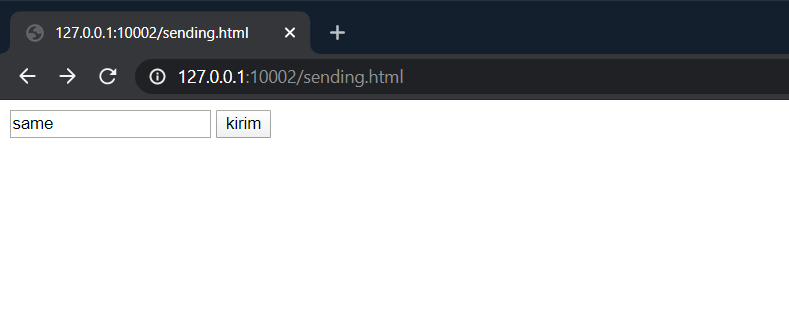
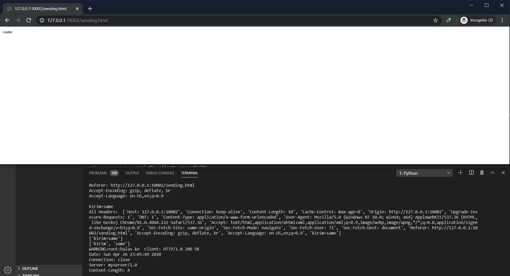

# Tugas 8

## Dokumentasi

## Tampilan
### Langkah - langkah

*Pertama* Jalankan server_thread_http.py

*Kedua* Bukalah http://127.0.0.1:10002/sending.html pada browser

Berikut adalah tampilan awal dari http://127.0.0.1:10002/sending.html

Kemudian setelah dikirim akan seperti ini, begitu juga respon pada server_thread_http.py

